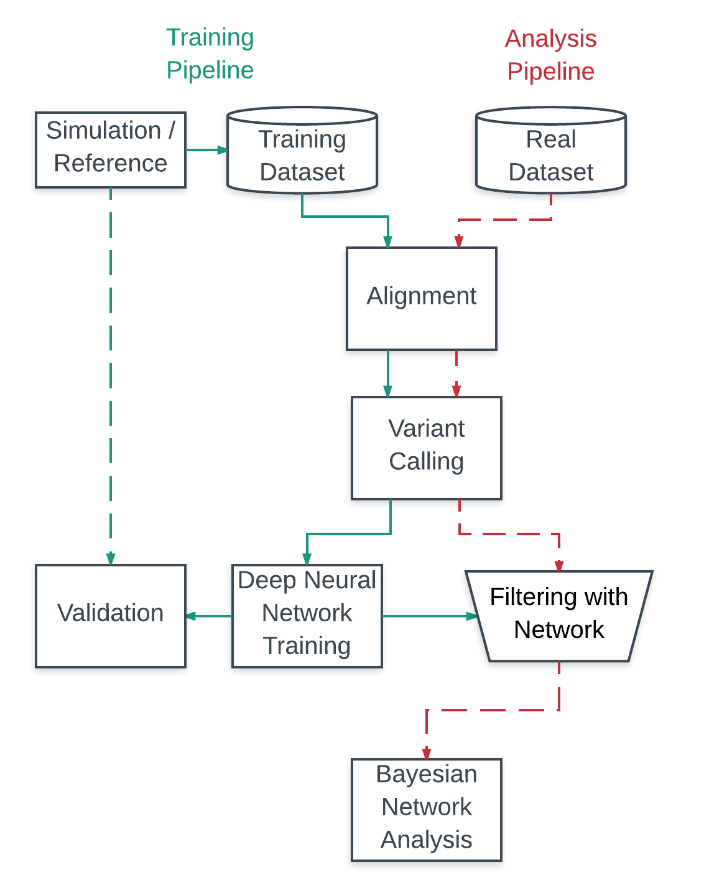

----------------------------------------------------------------------
# Variant Calling and Ranking

_Note : This program is still in development without proper build and configuration tools._

## Description 

The advent of next-generation sequencing technology has enabled large-scale interrogation of the genome to identify variants in patient samples. The accurate identification of functional variants can provide critical insights into the disease process to guide diagnosis and treatment. However, the use of clinical genomics remains limited as (i) the accurate identification of variants remains suboptimal, and (ii) the large number of variants identified may be difficult to interpret without a systematic approach of ranking by functional importance.
Here, we describe the development of a software platform analysing variant call data that implements a deep learning neural network to improve the accuracy of variant-calling, and a Bayesian classification method for the probabilistic ranking of functionally relevant genes.
 

Explanation of what this software was used to do can be found in [***the paper here***](https://github.com/EdwinChanSingapore/mlmutation/blob/master/docs/edwin_chan_thesis_2017.pdf).

## Components 

## Analysis, Machine Learning and Ranking 

The analysis software contain the feature extraction and engineering component that generates features from the vcf entries, the deep learning component that initialises the machine learning network and trains it using extracted features, and finally the Bayesian graphing component that performs Bayesian updating to rank the mutations in terms of importance using annotations from ANNOVAR. By integrating information of all five callers into a neural network, we allow the network to use features of each variant call to predict whether a mutation is true or not. Our research shows that there is a [significant difference in using such a neural network to analyse if mutations are true](https://github.com/EdwinChanSingapore/mlmutation/blob/master/docs/edwin_chan_thesis_2017.pdf). Subsequently, ranking the mutations allows us to provide clinicians with a set of most important mutations that they can focus on.

___Preprocessing and Analysis___

The preprocessing and analytical components are implemented using Python (v2.7) (Van Rossum, 2007) and the following Python libraries: NumPy, scikit-Learn, Pomegranate and PyVCF. Briefly, NumPy (v1.11.3) was used to prepare feature vectors for deep learning training, scikit-learn (v0.18.1) was used to perform Principal Component Analysis (PCA) and Synthetic Minority Oversampling Technique (SMOTE) methods (See Appendix 5.3.3 for details). PyVCF (v0.6.8) was used to parse the VCF files to facilitate the comparison of variants efficiently in O(1) time using hash-based dictionary lookups. 

_[analysis/machinelearning](https://github.com/EdwinChanSingapore/mlmutation/tree/master/analysis/machinelearning) contains the extraction of features from the vcf files, mainly with the methods found in extractfeaturesfromvcf.py._

___Deep Learning Networks___

Deep learning networks are implemented using the Keras library (v1.1.1) with a TensorFlow backend (v0.11.0). TensorFlow, from Google (Abadi et al., 2015), is used for better network training performance due to its distributed computation and queue management system. These network learn from features extracted from the VCF file (see [paper](https://github.com/EdwinChanSingapore/mlmutation/blob/master/docs/edwin_chan_thesis_2017.pdf) section 2.7 for more details on feature extraction), and are used to create a likelihood probability of the mutation being true.

_[analysis/machinelearning](https://github.com/EdwinChanSingapore/mlmutation/tree/master/analysis/machinelearning) contains the scripts that control initialisation and training of the neural network, particularly in generatematrixesforneuralnet.py and generateresultsforneuralnet._

___Bayesian Network Ranking of Mutations___

For the Bayesian ranking of mutations, the high confidence calls from the deep learning network are annotated using ANNOVAR (v2015Jun17) (Wang, Li, & Hakonarson, 2010). The annotated features for each variant are used as inputs to the Bayesian network, which was implemented using Pomegranate (v0.6.1), a Python library for Bayesian analysis. 

[analysis/prediction](https://github.com/EdwinChanSingapore/mlmutation/tree/master/analysis/prediction) contains the scripts that build the bayesian ranking network and the accompany graphs and networks.

## Simulator 

Simulator software refers to the software used to generate simulated datasets for analysis, which enables us to generate ground truths mutations by perturbing known reference genomic datasets. This overcomes the difficulities of establishing ground truth mutations in real datasets, and serves as a preliminary source of data for neural network optimisation. Mason, a genome mutation software written in C++ (v2.3.1), is used to simulate sequence reads with known error rates and ground truth variants. Default error rates (indel and substitution rates) use published data from Schirmer et al. (2016).

_[simulators/scripts](https://github.com/EdwinChanSingapore/mlmutation/tree/master/simulators/scripts) contains the base scripts that control the running of the simulator software._

___Pipelining Using NextFlow___

The workflows in the training and analysis pipelines are managed using NextFlow (v0.21.3.3990), a Groovy based Domain Specific Language (DSL) that provides easy management of parallel pipelines consisting of dependent tasks organised as a directed acyclic graph (Tommaso et al., 2014). Nextflow was used to manage and coordinate the different steps in the pipelines to ensure reproducibility and scalability.

_[simulators/pipelines](https://github.com/EdwinChanSingapore/mlmutation/tree/master/simulators/pipeline) contains all the pipelining software written in nextflow to automate simulator and variant calling processes._

___Variant Calling and Alignment___

Variant Callers are bioinformatics tools used to call mutations, which are specific genomic differences between a sample genome and a reference genome. However, individual variant callers suffer from having low concordances, and have high false positive rates. Here, we aggregate the data from five different variant callers to update and inform our deep learning network. The software used for variant calling are : FreeBayes (v1.0.2-16); GATK Haplotype Caller (v3.7-0) and Unified Genotyper (v3.7-0); Samtools (v1.3.1); Pindel (v2.3.0) (Garrison & Marth, 2012; McKenna et al. 2010, DePristo et al. 2011; Li H, et al., 2009; Ye et al., 2009). 

_[simulators/scripts](https://github.com/EdwinChanSingapore/mlmutation/tree/master/simulators/scripts) contains the base scripts that control the running of the variant calling software, as well as the options used to run the variant callers._

## Overall Pipeline

Two main computational pipelines are present in this software : (i) a training pipeline for training and the optimisation of the neural network, and (ii) an analysis pipeline that uses a trained neural network to perform variant prediction and validation (See Below). 

In the training pipeline, training datasets from synthetic and real sequencing data were used for performing the processing steps of alignment, variant calling and training of the deep learning network. In the analysis pipeline, the trained and optimised network from the training pipeline is then used to predict high-confidence variant calls in naive samples without ground truth variant calls. Finally, Bayesian network analysis is used to rank the functionally important variants/mutations from the high confidence calls identified from naive samples in the analysis pipeline.

Main documentation about this software can be found in the Introduction/Materials and Methods of [***here***](https://github.com/EdwinChanSingapore/mlmutation/blob/master/docs/edwin_chan_thesis_2017.pdf).
